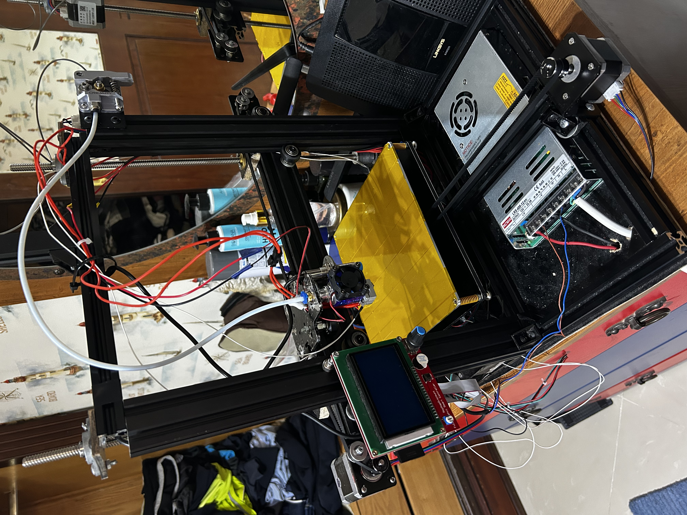
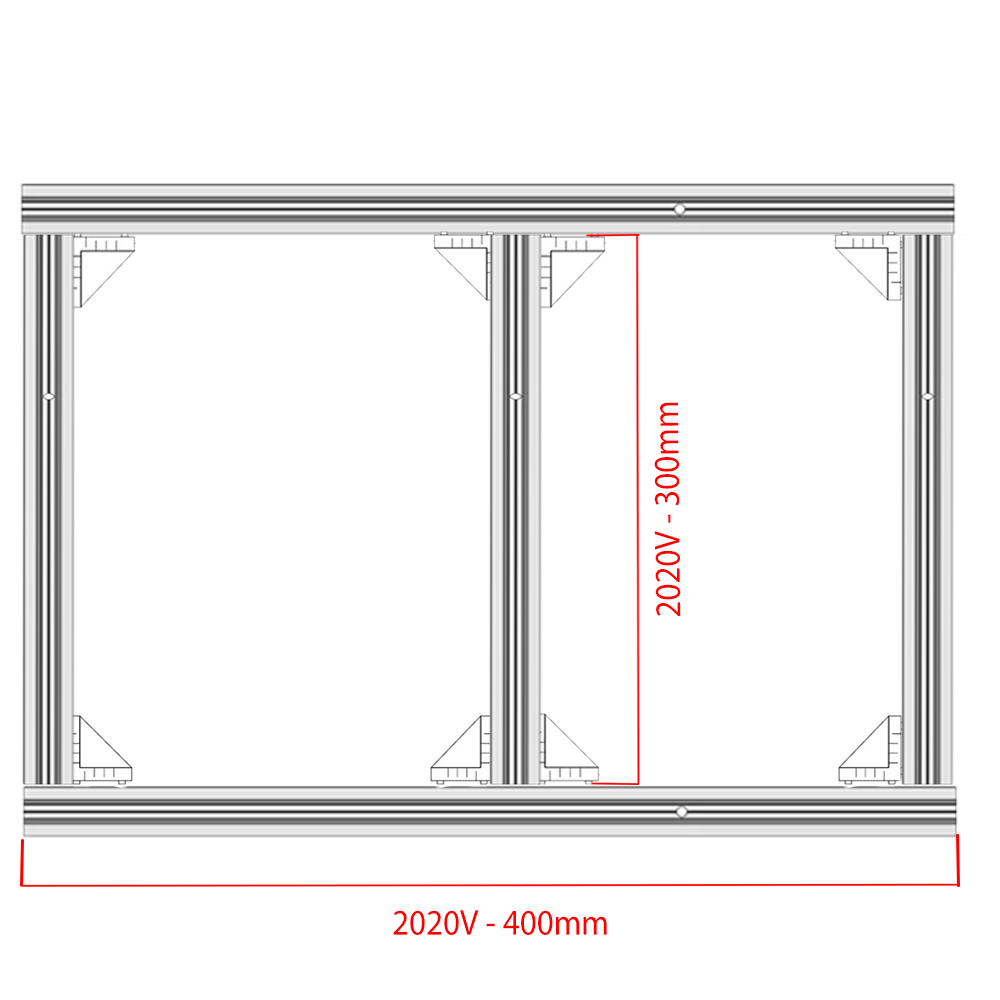
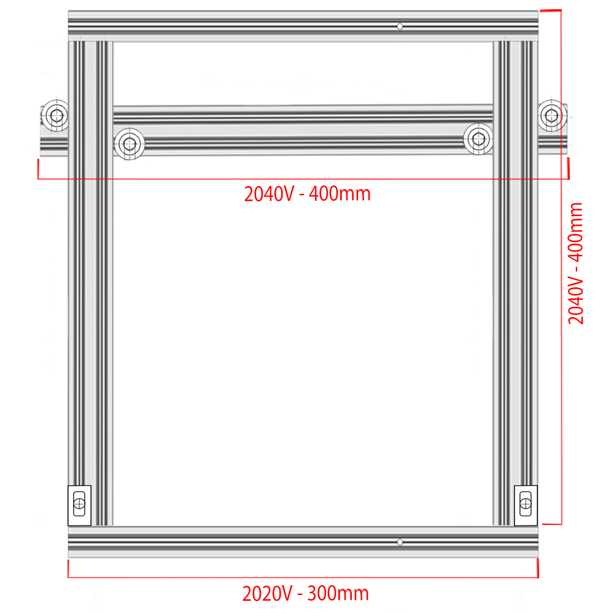
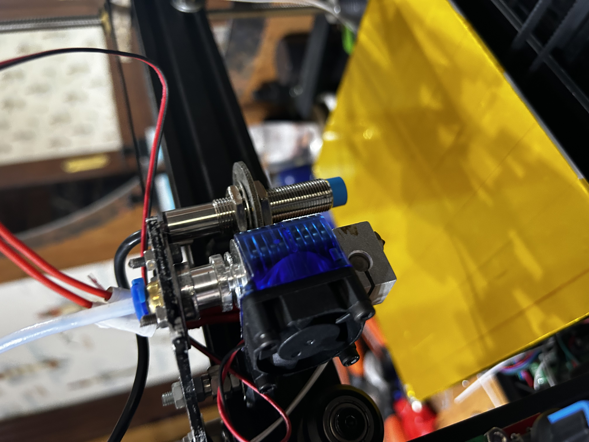
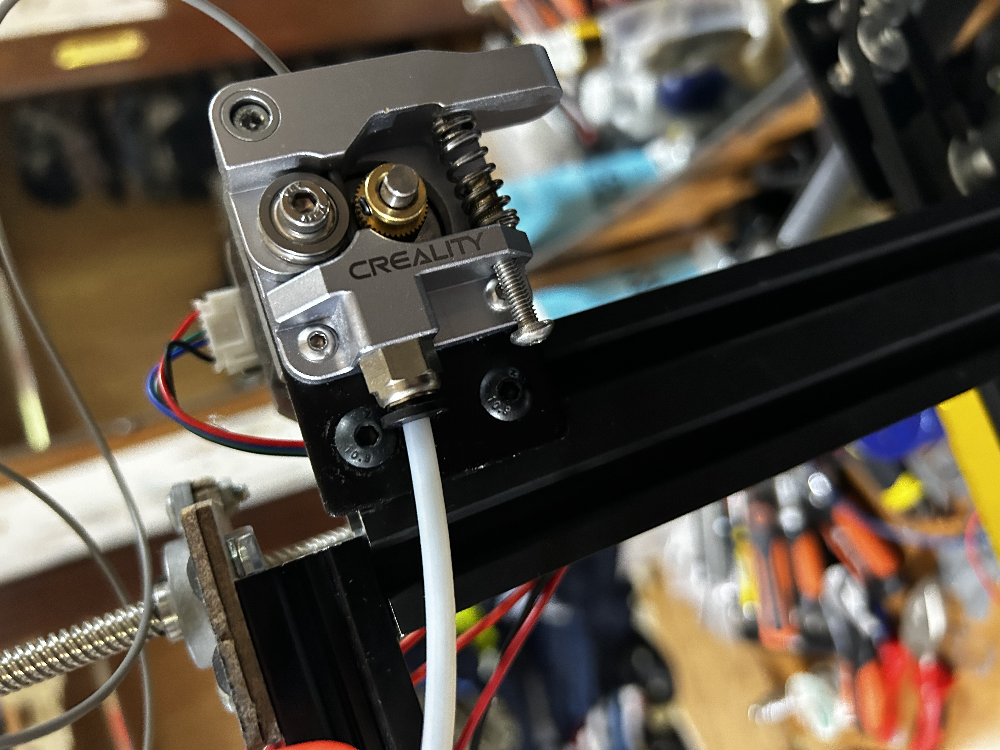
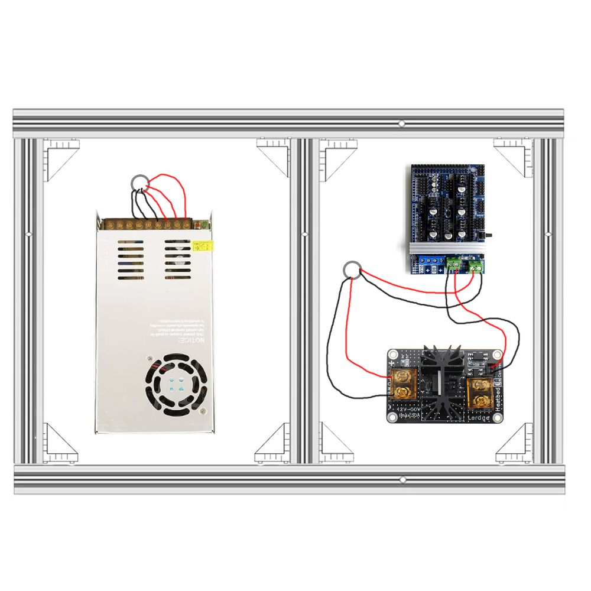
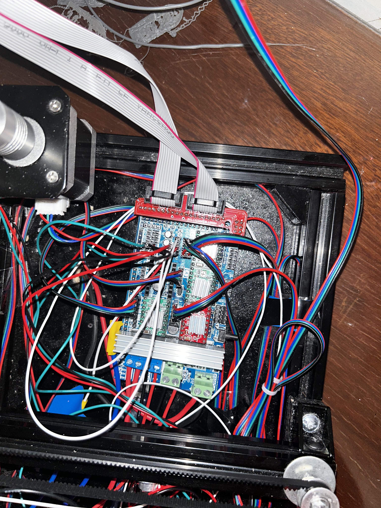

# happy-toaster-3d-printer

    
  

A personal 3D printer build designed from scratch, featuring custom marlin firmware and hardware tweaks. 

Where I live, 3D printers are imported and usually cost far more than most people can justify.  
To make 3D printing accessible (and satisfy my curiosity), I decided to design and build my own printer from scratch — for a fraction of the usual price.  

**Note:** The diagrams and setup steps below show the original 220×220 mm build area.  
In my later revision, I upgraded the printer to a larger bed (300×300 mm) and updated the firmware accordingly
— this involved only two lines of code changing the bed size constants. Both versions are compatible with this design.

---

### Acknowledgments
Thanks to the open-source 3D printing community — especially Marlin devs and countless makers who share their designs online. This project wouldn’t exist without that shared knowledge.

---

## Materials

### Frames
- 3 × 2020V-4.2 aluminum extrusion, 400 mm  
- 3 × 2040V aluminum extrusion, 400 mm  
- 4 × 2020V-4.2 aluminum extrusion, 300 mm  
- 20 × 2020 Aluminum Profile Connector Set  
  - *Make sure they include drop-in T-nuts. Buy extra; they’re useful for later mods.*  
- 2 × Threaded T8 lead screw, 8 mm pitch, 400 mm length  
- 1 × Alloy black hotbed Y carriage plate (for Ender 3 / CR-10)  
- 4 × Anti-vibration feet (for i3 MK3 printer kits)  
- 1 × Funssor HE3D/Tarantula I3 aluminum X-axis carriage plate (MGN12H upgrade, 3 mm thick)  
- 2 × Z-rod bearing holder (for aluminum profile frame)  

---

### Mechanical Components
- 2 × Z-axis stepper motor mount (NEMA17)  
- 2 × NEMA17 stepper motor mounting brackets (42-series)  
- 1 × Open-source idler pulley plate  
- 1 × NEMA17 stepper motor fixed mount (for X-axis)  
- 1 × V6 J-head Bowden hotend + extruder kit  
- 20 × 2020-series L-type internal corner brackets (with screws)  
- 12 × POM V-slot linear pulleys (clear polycarbonate)  
- 2 × Flexible couplers for T8 threaded rod (8 mm)  
- 1 × All-metal Bowden extruder feeder kit (with PTFE tube)  
- 10 m GT2 open timing belt, 6 mm width  
- 5 × GT2 20-tooth idler pulleys (with teeth)  
- 3 × GT2 idler pulleys (without teeth)  

---

### Boards & Electronics
- 5 × Cloudray NEMA17 stepper motors (0.42 N·m torque, 1.7 A, 2-phase, 40 mm)  
- 1 × HT-100K NTC thermistor (100K Ω)  
- 1 × 30A heated bed MOSFET expansion module (with cables, compatible with Anet A8/A6/A2/RAMPS 1.4)  
- 1 × MZMW LRS350/LRS400 switching power supply (400 W, 12 V)  
- 1 × MK3/MK2 heated bed (220×220×3.0 mm, 12 V)  
- 1 × Arduino Mega 2560 R3  
- 1 × RAMPS 1.4 controller board  
- 5 × A4988 stepper driver modules
- 1 x M8 Inductive Proximity Sensor Z Probe
- 2 x Switch Endstop
- 1x LCD Display for Ramps Board

---

### Notes
If you’re sourcing parts locally or from multiple suppliers, double-check connector compatibility (especially for the stepper motors and MOSFET module). Keep a few extra T-nuts and corner brackets for future modifications — they’re always useful. I needn't mention that but you must have tools ready at hand at all times like screwdrivers, power tools, screws, nuts, the general stuff.

## Build Process

The **Happy Toaster** is built in **three main stages**, followed by firmware setup.  
Each stage can be completed independently and tested before moving on.

### 1. Frame Assembly
The foundation of the printer — aluminum extrusion frame and motion rails.  
This step covers:
- Cutting and assembling the frame to the 220×220 mm spec (later expanded to 300×300 mm).  
- Installing linear bearings and ensuring square alignment.  
- Mounting the bed platform and Z-axis supports.

> **Tip:** Even small misalignments here can cause major print issues later, so take your time squaring the frame.

---

### 2. Mechanical Systems
This stage adds motion and structure:
- Mounting the X, Y, and Z carriages  
- Installing lead screws, belts, and pulleys  
- Assembling the hotend and extruder  
- Checking smooth travel and calibration manually  

> **Note:** At this point, the printer should move freely by hand without binding.

---

### 3. Electronics and Wiring
This is where the printer becomes alive.  
Steps include:
- Installing stepper motors and limit switches  
- Wiring the mainboard, display, and power supply  
- Cable management and grounding safety checks  

> **Optional Add-ons:** LED lighting, cooling fans, or cable sleeves can be added here.

---

### 4. Custom Firmware (Marlin)
Once the hardware is ready, flash the custom **Marlin CFW** provided in this repository.  
The configuration includes:
- Bed dimensions (adjustable for 220×220 or 300×300)  
- Motor direction and steps/mm tuning  
- Endstop and thermistor setup  

---

Step 1 — Frame Setup

   <em>Base Frame *top view*</em> 

3x 2020v 300mm Frame
 2x 2020v 400mm Frame
 8x Frame connectors

- Begin with the base 2020 extrusions and corner connectors.
- Ensure perfect 90° alignment using a square or angle bracket.

   <em>Base Frame *FRONT VIEW*</em> 
1x 2020v Frame 300mm
 2x Frame Connectors
 2x Internal Frame Connectors
 4x Wheels

- Start getting the 2040 extrusions and work you way up to make the frame the X axis frame will hold onto, along with the bowden extruder and later on hang up the 3d printer screen.
- Use the slightly larger 2040v (400mm) to place 4 wheels that will bite onto the vertical 2040v frame
- after loading the x axis frame with wheels onto the vertical frame, connect a top piece so that the x axis frame is set inside.

                                                                                                

   <em>Base Frame w/ X Axis mechanism *BACK VIEW*</em> 

1x NEMA17 stepper motors
 2x GT2 20-tooth idler pulleys
 2x GT2 idler pulleys no teeth
 10 m GT2 open timing belt, 6 mm width  
 4x wheels
 2x Zip ties
 some drop in tee nuts and screws for the following frames:
 NEMA17 stepper motor mounting bracket
 Open-source idler pulley plate bracket
 Funssor HE3D/Tarantula I3 aluminum X-axis carriage plate (MGN12H upgrade, 3 mm thick)  
  

- For the hotend x-axis carriage plate start with putting on the four wheels and place onto the x frame accordingly
- Place the nema 17 motor onto its respected plate, screw onto the motor a toothed gear and for one of the screws on the top left use an extra long screw to place a Idle pulley no teeth (refer to left side of diagram where the motor is) then place onto either side of the x axis frame
- on the other side place one toothed pulley and one smooth no teeth, thats so far your base for running a timing belt onto the x axis frame
- Using zip ties, lock the timing belt onto either side of the tarantula hotend x carriage plate and then run the timing belt around the frame make sure it is latched onto the idler pulleys and also make sure it is run through the middle of the 2040V FRAME in the middle (there should be a little space in the middle of the frame where it can go through.

   <em>Base Frame, Z rod Mechanism *BACK VIEW*</em> 

2x NEMA17 Stepper Motors
 2x Z Axis Stepper Mounts (aluminum bracket type)
 2x Threaded T8 Lead Screws, 8mm pitch, 400mm length
 2x Flexible Couplers for T8 rods
 2x Z Rod Bearing Holders (for top frame)
  **I MUST MENTION, i had no way of finding a frame that works with the BRASS NUT for the Z rods, so i cut out a piece of wood and anchored the BRASS NUT TO IT to place on the X frame (the one with wheels)**

- Mount each NEMA17 motor to its aluminum bracket using M3 screws.
- Secure both motor mounts at the base of the vertical 2040V extrusions; make sure they sit flush and parallel.
- Insert each T8 lead screw into its flexible coupler and tighten the grub screws evenly (leave a small gap between shafts to prevent stress).
- Attach the 2020V top frame and fit the Z-rod bearing holders at the top ends of the lead screws for stability.
- Spin both lead screws manually — they should move smoothly and evenly with no binding.
- Once aligned, apply a tiny drop of threadlocker to each coupler’s grub screw to prevent loosening over time.

   <em>Base Frame, Bowden Extruder and hotend *FRONT VIEW*</em> 

1x NEMA17 Stepper Motors
 1x Nema17 Stepper Motor Holder Bracket Frame
 1x Bowden Extruder (mounted onto the frame)
 1x PTFE Bowden Tube (should come with bowden extruder)
 1x J6 Hotend assembly (heatsink, heatbreak, nozzle) 
 M8 Inductive Proximity Sensor Z Probe 

- Mount the Bowden extruder assembly on the right side of the upper 2040 frame using drop-in T-nuts and screws.
- Attach the NEMA17 stepper motor onto the extruder bracket and secure it firmly so it doesn’t flex during retraction.
- Cut the PTFE tube to the appropriate length, ensuring smooth filament travel with minimal bend radius.
- Connect one end of the tube into the extruder fitting and the other into the hotend’s pneumatic connector.
- Place the hotend assembly onto the X-axis carriage plate and secure it using M3 screws.
- Plug in the cooling fan onto the hotend side, ensuring airflow faces the heatsink (not the nozzle).
- Double-check alignment between the Bowden tube and the hotend so filament feeds straight and smoothly.
- IMPORTANT NOTE: In the diagram it doesnt show but there is a Z Probe **(M8 Inductive Proximity Sensor Z Probe)** that is hooked to a washer and the washer is held in place with the X Carriage by a screw

   <em>Base Frame, bed Mechanism *FRONT VIEW*</em> 

1x NEMA17 Stepper Motor (for Y-Axis)
 1x NEMA17 Motor Mount Frame
 1x GT2 20-Tooth Pulley Gear (toothed)
 1x GT2 Smooth Idler Pulley (toothless)
 10 m GT2 Timing Belt, 6 mm width
 4x V-slot Wheels (for Bed Carriage)
 1x Aluminum Bed Carriage Frame
 1x 220×220 mm Heated Bed with Screws and Springs
 1x 2020V Aluminum Extrusion 400 mm
  4x Frame Connectors
 1x Spacer Block / Riser (for electronics clearance under frame)
  

- Start by mounting the NEMA17 stepper motor onto the Y-axis motor bracket, attaching the toothed pulley gear to the motor shaft.
- On the opposite end of the 2020V frame, mount the smooth idler pulley using a drop-in T-nut and screw — ensure it aligns perfectly with the motor pulley to prevent belt skew.
- Attach the bed carriage frame onto the V-slot extrusion with four wheels, ensuring smooth linear motion along the Y-axis.
- Mount the heated bed onto the carriage frame using the provided screws and springs for height leveling.
- Run the GT2 timing belt through the pulley system — one end anchored to the bed carriage, looping around both pulleys, then tied back to the carriage with zip ties.
- Finally, place a spacer block or printed riser under the 2020V Y-axis frame to lift it slightly and make room for electronics wiring underneath.

    NOW, so far it should looks somewhat like this:

  
  
  

---

Part 2: Electronics, boards, & wiring

  
   

1× Arduino Mega 2560 R3
 1× RAMPS 1.4 Controller Board
 5× A4988 Stepper Driver Modules
 5× NEMA17 Stepper Motors
 1× MZMW LRS350/LRS400 12V 400W Power Supply
 1× MK3/MK2 Heated Bed (220×220×3.0 mm, 12 V)
 1× 30A Heated Bed MOSFET Expansion Module (with cables)
 1× HT-100K NTC Thermistor (100K Ω)
 1× M8 Inductive Proximity Sensor (Z-Probe)
 2× Mechanical Endstop Switches
 1× LCD Display Screen (with EXP1/EXP2 cables)
 Assorted: 12 AWG wire (for power), Dupont jumpers, heat shrink, zip ties, cable sleeves for clean routing

- Begin by mounting the Arduino Mega 2560 beneath the frame, leaving room for access to the USB and power ports. Attach the RAMPS 1.4 board on top of it.
- Insert the five A4988 stepper drivers into their sockets on the RAMPS board, ensuring correct orientation (reference the small “EN” and “DIR” labels).
- Connect each NEMA17 motor to its respective axis output on the RAMPS board:

X-Axis → X Motor

Y-Axis → Y Motor (bed carriage motor)

Z-Axis → both Z motors (connect in parallel)

E0 → Extruder motor

- Wire the endstops to the X-min and Y-min connectors on the RAMPS board, and the inductive Z-probe sensor to the Z-min input (the firmware will later handle the probing logic).
- For the hotend: connect the HT-100K thermistor to T0 and the hotend heater cartridge to D10.
- The heated bed connects through the MOSFET module to offload current:
- RAMPS D8 output → MOSFET signal input
- Power Supply 12V → MOSFET power input → Heated bed
- Attach the LCD Display using the EXP1 and EXP2 ribbon cables; it should power up alongside the RAMPS board.
- Finally, connect the 12V power supply to both the RAMPS and MOSFET modules, using 12 AWG wire for main power lines. Double-check polarity before powering up.

   <em>RAMPS 1.4 Wiring — *Hotend, Bed, Motors & Endstops*</em> 

- Dont expect the wiring to be clean the first try. Once everything is connected, use cable sleeves and zip ties to manage your wiring. Keep motor and signal cables away from power lines to reduce interference. Don’t power on yet—firmware setup and calibration come next.

